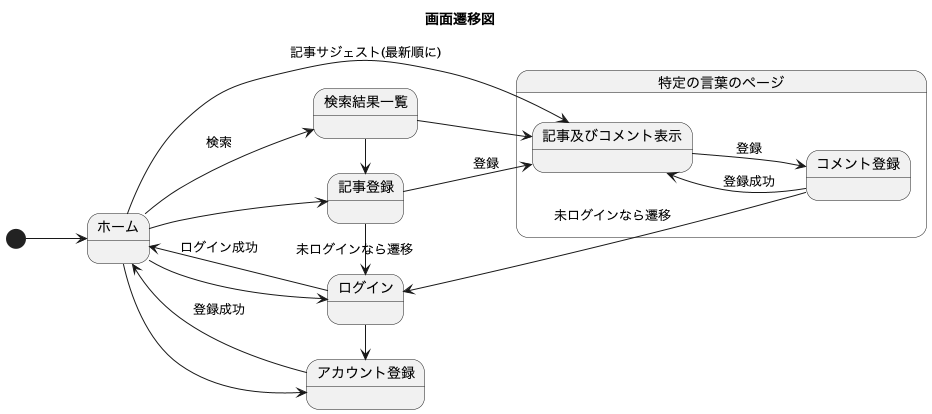
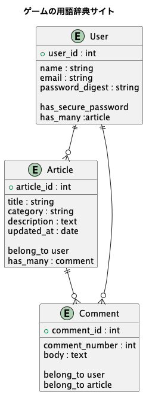

# dxd-glossary_rails
dxd           = DragxDriveというゲーム 
glossary      = 用語集 
dxd-glossary  = ゲームの用語集 

ゲームの用語(攻略記事)投稿サイトです。 
ユーザー登録機能や記事のCRUD機能に加えて、各記事にコメントを投稿できます。

DragxDrive(=dxd)というゲームに向けて作成しましたが、リポジトリにはゲームのコンテキストは含まれていないため、他ゲーム用のサイトとしても流用可能です。

## URL
準備中

ログインしなくても記事を確認することができます。

## 作成背景
・Ruby学習のため 

・そのゲームのコミュニティにおいて、攻略情報やノウハウが蓄積されているものの、情報の投稿先がユーザーごとに色々なSNSに分散しており、欲しい情報を知るためには複数SNSから探さなければならないという課題がありました。 

情報を見つけやすくするためのポータルサイト及び記事を投稿するサイトが必要であると感じ、本プロジェクトを作成しました。

## 機能一覧
- ユーザー登録、ログイン機能(bcrypt使用。deviceなし)
- 記事投稿機能
  - 記事CRUD機能
  - 記事に対するコメント機能
- 記事検索機能(ransack)

## テスト
- RSpec
  - 単体テスト(spec/model)
  - 結合テスト(spec/system)

## 使用技術
- Ruby 4.0.1
- Ruby on Rails 8.1.3
  - bootstrap 5.3.8
  - RSpec 3.13.2
- PostgreSQL 18.3

## データベース設計
